# Introduction and installation of R/Rstudio  

* https://youtu.be/wlzwYtHu2xA


## What is R / Rstudio 


R은 통계나 생물통계, 유전학을 연구하는 사람들 사이에서 널리 사용되는 오픈소스 프로그래밍 언어 입니다. Bell Lab에서 개발한 S 언어에서 유래했으며 엄청나게 많은 라이브러리 (다른 사람들이 만들어 놓은 코드)가 있어서 쉽게 가져다 사용할 수 있습니다. R은 복잡한 수식이나 통계 알고리즘을 간단히 구현하고 사용할 수 있으며 C, C++, Python 등 다른 언어들과의 병행 사용도 가능합니다. R은 IEEE에서 조사하는 Top programming languages에서 2018년 7위, 2019년 5위, 2020년 6위로 꾸준히 높은 사용자를 확보하며 빅데이터, AI 시대의 주요한 프로그래밍 언어로 사용되고 있습니다. 

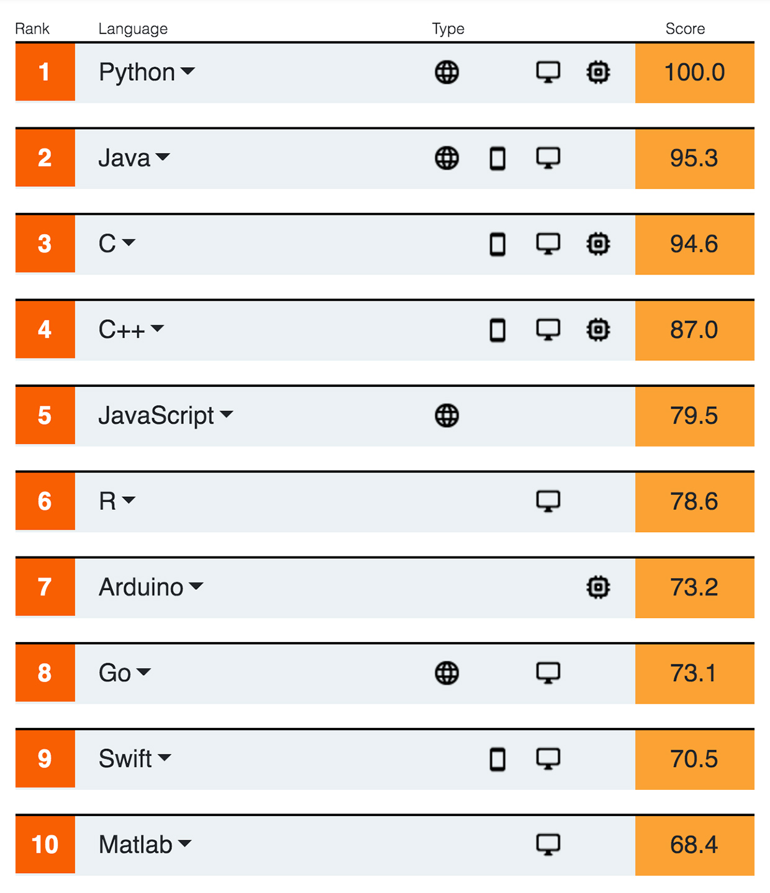{width=350px}


R은 데이터를 통계분석에 널리 사용되는데 이는 데이터를 눈으로 확인하기 위한 visualization 이나 벡터 연산 등의 강력한 기능 때문에 점점 더 많은 사람들이 사용하고 있습니다. 기존에는 속도나 확장성이 다른 언어들에 비해 단점으로 지적되었으나 R 언어의 계속적인 개발과 업데이트로 이러한 단점들이 빠르게 보완되고 있습니다. 


R 사용을 위해서는 R 언어의 코어 프로그램을 먼저 설치하고 그 다음 R 언어용 IDE(Integrated Development Environment)인 RStudio 설치가 필요합니다.  

## R installation

- R (https://www.r-project.org/) 사이트에 접속 후 좌측 메뉴 상단에 위치한 CRAN 클릭. 

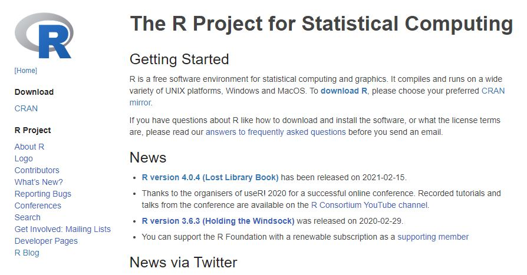{width=600px}

- 미러 사이트 목록에서 Korea의 아무 사이트나 들어감

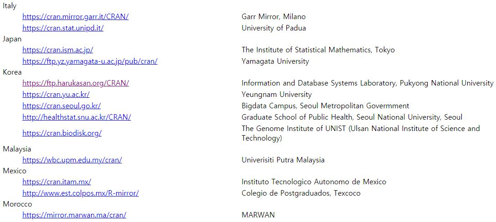{width=600px}


- Download R for Windows를 (windows OS의 경우) 클릭

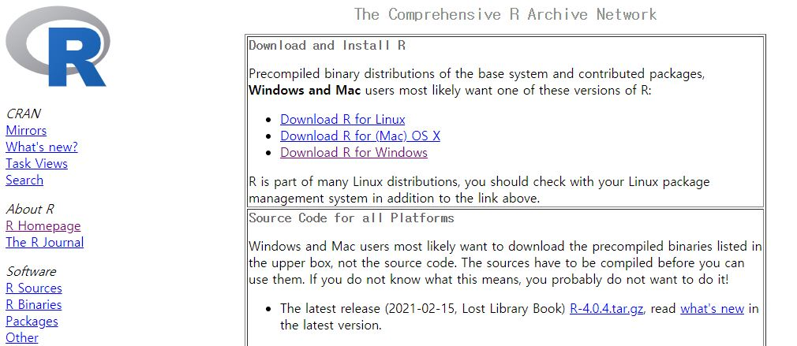{width=600px} 

- base 링크 또는 install R for the first time 클릭

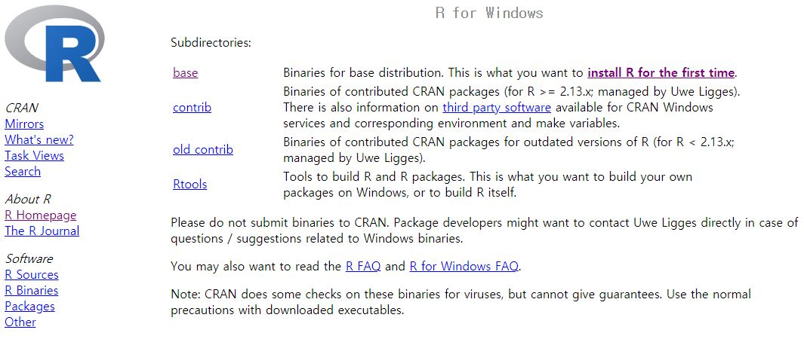{width=600px}


- Download R 4.0.4 for Windows 링크로 실행 프로그램 다운로드 (2021.3 현재 R 버전은 4.0.4). 로컬 컴퓨터에 Download 된 R-4.0.4-win.exe 를 실행하고 설치 프로그램의 지시에 따라 R 언어 소프트웨어 설치를 완료합니다. 

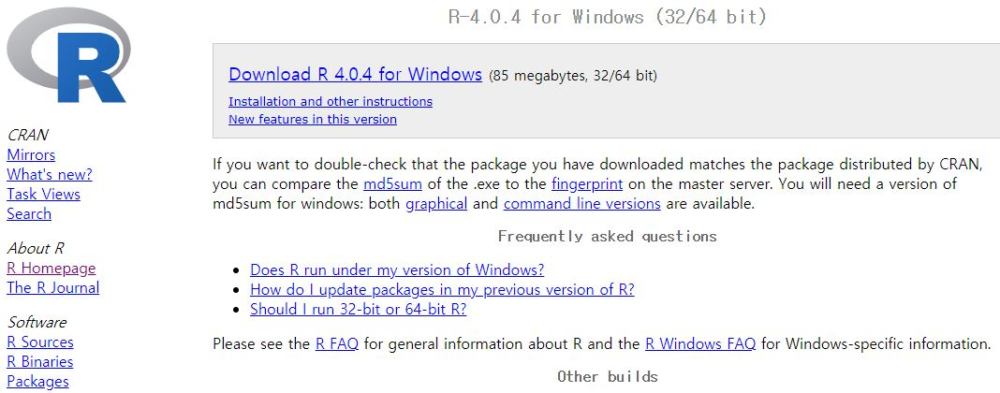{width=600px}


## Rstudio installation


Rstudio는 R 언어를 위한 오픈소스 기반 통합개발환경(IDE)으로 R 프로그래밍을 위한 편리한 기능들을 제공해 줍니다. R언어가 주목을 받고 두터운 사용자 층을 확보할 수 있게된 핵심 동력이 Rstudio 입니다. 자체적으로 오픈소스 개발팀이 있으며 `dplyr`, `ggplot`, `shiny` 등의 데이터 분석 및 소통을 위한 주요 패키지를 개발하였고 정기적으로 conference 개최를 하면서 기술 보급의 핵심 역할을 하고 있습니다. 다음과 같은 방법으로 RStudio를 설치할 수 있습니다. 

- https://www.rstudio.com/ 접속, 상단의 Products > RStudio 클릭 RStudio 페이지로 이동동

- 하단 RStudio Desktop 선택

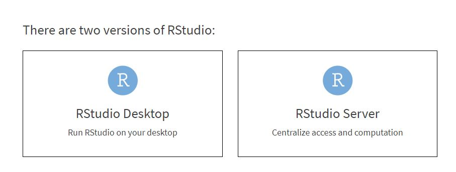{width=600px}  

- Open Source Edition의 Download RStudio Desktop 클릭

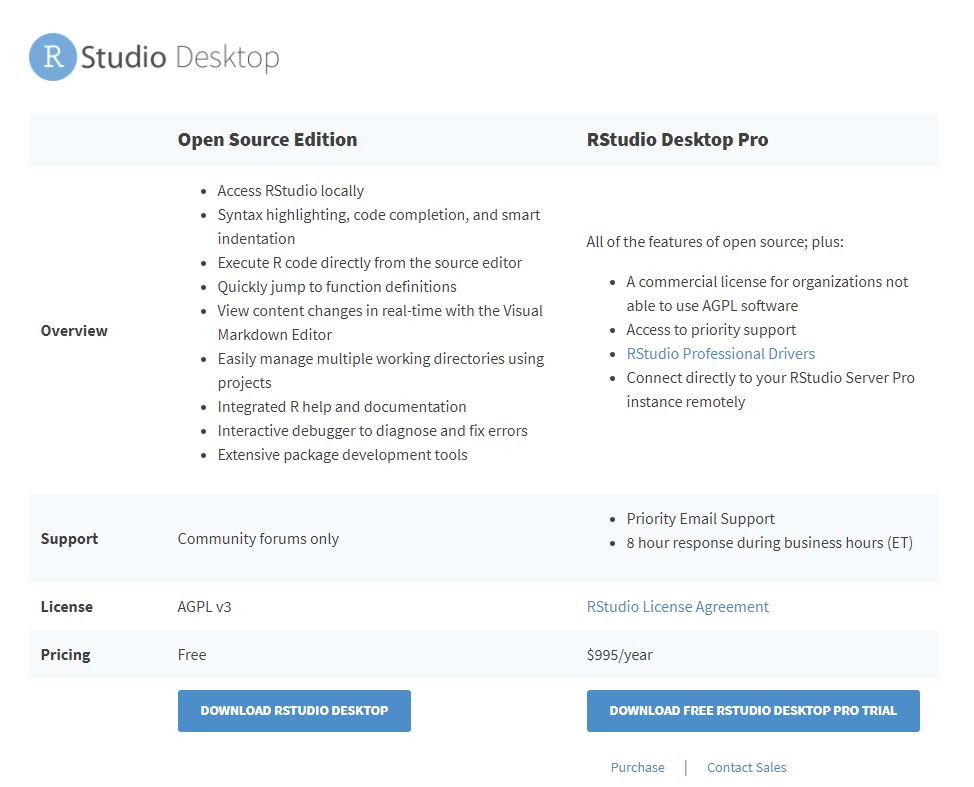{width=600px}  

- 하단 DOWNLOAD RSTUDIO FOR WINDOWS 클릭

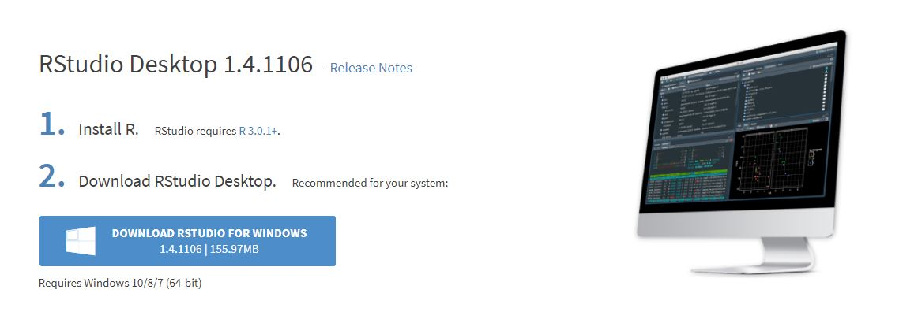{width=600px}  

- 2021.03현재 version 1.4.1106, 로컬 컴퓨터에 다운로드된 RStudio-1.4.1106.exe를 실행하고 설치 가이드에 따라 설치 완료합니다. 


## Rstudio interface
- 아래 그림의 좌측 상단의 공간은 코드편집창, 좌측 하단은 콘솔창 입니다. 

{width=600px} 


## New file & Set working directory 

새로운 R 파일 (또는 다른 형태의 파일)은 `File > New File > R Script` 의 메뉴를 통해서 생성할 수 있습니다. 일반적으로 이렇게 새로운 파일을 만들고 코드를 작성하기 전에 해당 작업을 수행하기 위한 작업 디렉토리를 설정할 필요가 있습니다. 

```{r, eval=FALSE}
getwd()
dir()
setwd("C:\\rprog2021")
getwd()
dir()
```

또는 아래와 같이 RStudio 메뉴 에서 설정 

{width=600px} 


## New project

위와 같이 파일을 만들고 작업 디렉토리를 설정하는 것보다 프로젝트를 만들고 파일들을 관리하는 것이 여러모로 편리할 때가 많습니다. `File > New Project`를 선택하면 아래와 같은 팝업창이 나타납니다. 

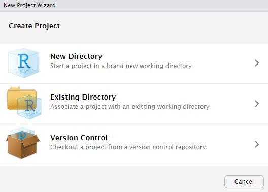{width=600px} 

여기서 `New Directory`를 선택하고 (또는 기존 디렉토리가 있을 경우 Existing Directory 선택) `New Project`를 클릭하면 다음과 같이 디렉토리 이름과 디렉토리가 생성될 위치를 지정할 수 있습니다. 이름은 `Rprog2021`로 하고 `C:/mydocs/2021/dev/` 이 곳에 생성되도록 하겠습니다. 

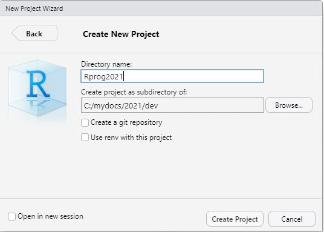{width=600px} 


그럼 아래와 같이 새로운 디렉토리가 생성되며 `Rprog2021.Rproj` 파일이 생성됩니다. 이제 언제든 해당 프로젝트를 작업할 때 이 `Proj` 파일을 실행하면 RStudio가 실행되고 최종 작업했던 상태에서 시작하게 됩니다. 작업 디렉토리 역시 `Proj` 파일이 위치한 디렉토리 위치로 자동으로 설정 됩니다. 


## Keyboard shortcuts

- 참고사이트 
  - https://support.rstudio.com/hc/en-us/articles/200711853-Keyboard-Shortcuts
  - Tools --> Keyboard shortcut Quick Reference (```Alt + Shift + K```)
- 코드편집창 이동 (```Ctrl+1```) 콘솔창 이동(```Ctrl+2```)
- 한 줄 실행 (```Ctrl+Enter```)
- 주석처리 (```Ctrl + Shift + C```) 
  - 또는 ```#```으로 시작하는 라인 

- 실습
  - 코드편집창에서 다음 입력 
  -   
  - 단축키 ```Ctrl + enter```로 코드 실행 
  - 단축키 ```Ctrl + 2```로 커서 콘솔창으로 이동
  - ```x```값 ```x+y```값 확인 
  - 단축키 ```Ctrl + 1```로 코드편집창 이동 
  - 단축키 ```Ctrl + Shift + C``` 사용

```{r, eval=F}
# x <- 10
# y <- 20

```


## Hello world

```{r, eval=FALSE}
mystring <- "Hello \n world!"
cat(mystring)
print(mystring)
```


## Help

R의 장점 중 하나로 방대한 양의 도움말 페이지가 제공됩니다. ```?``` 명령을 사용하면 되며 구글이나 웹에서도 도움을 얻을 수 있습니다. 

```{r, eval=F}
?cat
?print
?mean
help("mean")
example("mean")
help.search("mean")
help(package="MASS")
```


## R packages

R은 `package`라 불리는 다양한 함수 라이브러리를 사용할 수 있습니다. 예를 들어 `sum()` 이나 `sd()`와 같은 함수는 `stats`이라는 패키지에서 구현된 함수 입니다. `stats` 패키지는 R이나 Rstudio를 실행할 경우 기본으로 불려지는 패키지로서 별도로 불러오는 과정이 필요하지 않습니다. 이러한 패키지는 인터넷의 `repository`에서 구할 수 있으며 대표적인 `repository`는 The Comprehensive R Archive Network (CRAN) (http://cran.r-project.org/web/views/) 와 생물학자를 위한 Bioconductor (http://www.bioconductor.org/) 가 있습니다. 이러한 패키지의 설치는 아래와 같이 RStudio를 이용하거나 콘솔창에서 `install.packages()` 함수를 이용할 수 있습니다. 
 

{width=600px} 

- UsingR package installation

{width=600px} 

패키지를 설치하고 사용하기 위해서는 `library()` 함수를 사용해서 관련 명령어를 사용하기 전에 미리 loading 해 두어야 합니다. 한 번 로딩으로 작업 세션이 끝날때까지 관련된 함수를 사용할 수 있으나 R 세션이나 RStudio를 재시작 할 경우 다시 로딩해야 사용할 수 있습니다. 


```{r, eval=F}
library(UsingR)
```

- R 설치 디렉토리
- R 패키지 설치 디렉토리

```{r, eval=F}
.libPaths()
path.package()
```


## Data sets

대부분의 패키지는 함수와 함께 관련된 도움말, 예제, 그리고 데이터셋을 같이 제공해 줍니다. `library()` 함수를 사용할 때 자동으로 같이 로딩이 되며 `data()` 함수를 사용해서 사용자 작업공간에 복사본을 만들어서 사용할 수 있습니다. 

```{r, eval=F}
head(rivers)
length(rivers)
class(rivers)
data(rivers)
data(package="UsingR")
library(HistData)
head(Cavendish)
str(Cavendish)
head(Cavendish$density2)
data(package="HistData")
```


## Cheatsheet


---


<a rel="license" href="http://creativecommons.org/licenses/by-nc-nd/4.0/"></a><br />이 저작물은 <a rel="license" href="http://creativecommons.org/licenses/by-nc-nd/4.0/">크리에이티브 커먼즈 저작자표시-비영리-변경금지 4.0 국제 라이선스</a>에 따라 이용할 수 있습니다.


