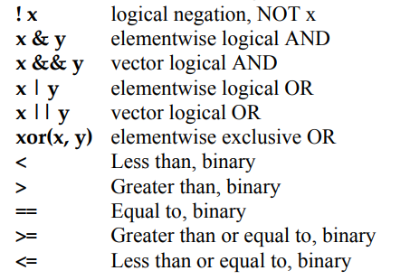

# R language basics II - Objects

* https://youtu.be/jYg88NoRc0A

## A script in R

R 프로그래밍을 통해서 사용자가 원하는 기능을 수행하는 방법은 다음과 같이 스크립트를 만들어서 실행하는 것 입니다. 일반적으로 R을 이용한 스크립트 명령을 어떻게 실행하는지 알아보겠습니다. 다음 예제는 입력 값들의 평균을 계산해서 출력해 주는 스크립트 명령입니다. R base 패키지에서 기본으로 제공되는 `mean()`이라는 함수가 있지만 사용하지 않고 `sum()`과 `length()` 함수를 사용했습니다.

```{r, eval=F}

numbers <- c(0.452, 1.474, 0.22, 0.545, 1.205, 3.55)
cat("Input numbers are", numbers, "\n")
numbers_mean <- sum(numbers)/length(numbers)
out <- paste("The average is ", numbers_mean, ".\n", sep="")
cat(out)

```

상황에 따라 다르긴 하지만 보통 위 스크립트를 실행할 때 R 파일을 하나 만들고 `source()`라는 함수를 사용해서 파일 전체를 한번에 읽어들이고 실행을 시킵니다. 위 코드를 `myscript.R` 이라는 새로운 R 파일을 하나 만들고 저장 후 다음과 같이 실행할 수 있습니다. 참고로 위 파일은 현재 Working directory와 같은 위치에 저장해야 합니다.

```{r eval=F}
source("myscript.R")
```

그러나 위와 같은 식으로 실행할 경우 다음 몇 가지 문제가 있습니다. 하나는 입력 값이 바뀔 때마나 파일을 열어 바뀐 값을 저장해 줄 필요가 있습니다. 결과 값에 대해서 다른 처리를 하고 싶을 경우 또한 파일을 직접 수정해 주어야 합니다. 또한 모든 변수들이 전역변수로 사용되어 코드가 복잡해질 경우 변수간 간섭이 생길 가능성이 높습니다.

## Functions

함수를 사용하면 위와같은 문제를 극복할 수 있습니다. 함수(Function)는 다음과 같은 포멧으로 구현할 수 있습니다.

```{r, eval=FALSE}
my_function_name <- function(parameter1, parameter2, ... ){
  ##any statements
  return(object)
}
```

예를 들어 다음과 같은 `my_sine` 함수를 만들 수 있으며 parameter (매개변수)는 `x`이고 `y`는 반환값을 저장하는 지역변수 입니다.

```{r, eval=FALSE}
my_sine <- function(x){
	y <- sin(x)
	return(y)
}
```

만들어진 함수는 다음과 같이 사용할 수 있습니다. 만들어진 함수는 처음에 한 번 실행해 주어 실행중인 R session에 등록한 후 사용할 수 있습니다. 여기서 함수로 전달되는 값 `pi`는 argument (전달인자) 라고 합니다. 전달인자는 함수에서 정의된 매개변수의 갯수와 같은 수의 전달인자를 입력해 주어야 합니다.

```{r, eval=F}
my_sine(pi)
my_sine(90)
sin(90)
```

-   Terminology

    -   function name: `my_sine`
    -   parameter: `x`
    -   argument: `pi`
    -   return value: `y`

이제 위 스크립트 ('myscript.R') 에서 사용된 코드를 함수로 바꿔봅니다. numbers (전달인자)를 받는 매개변수를 x로 하고 함수 이름은 `mymean` 이고 평균값 (numbers_mean)을 반환하는 합수입니다.

```{r, eval=F}
numbers <- c(0.452, 1.474, 0.22, 0.545, 1.205, 3.55)

mymean <- function(x){
  cat("Input numbers are", x, "\n")
  numbers_mean <- sum(x)/length(x)
  out <- paste("The average is ", numbers_mean, ".\n", sep="")
  cat(out)
  return(numbers_mean)
}

retval <- mymean(numbers)
cat(retval)

```

`myscript.R`이라는 파일을 열고 작성된 스크립트에 더해서 아래처럼 함수 코드를 만들 경우 `source()` 함수로 함수를 세션으로 읽어오고 바로 사용할 수 있습니다. 위와 같이 함수를 만들 경우 입력 값을 언제든 바꿔서 사용할 수 있고 반환값에 대한 추가적인 연산도 쉽게 수행 할 수 있습니다.

```{r, eval=F}
new_values <- c(1:10)
retval <- mymean(new_values)
retval
```

### Exercise 3-1

1)  `mysd`라는 이름의 (표본)표준편차를 구하는 함수를 `myscript.R` 파일에 구현하시오 (`sd()`함수 사용하지 않고, 다음 표준편차 공식 이용)

$$ 
\sigma = \sqrt{\frac{\sum(x-mean(x))^2}{length(x)-1}} 
$$

코드는 아래와 같음

```{r, eval=F}
mysd <- function(x){
  numbers_sd <- sqrt(sum((x - mymean(x))^2)/(length(x)-1))  
  return(numbers_sd)
}

```

2)  1부터 100까지의 값을 `x`에 저장하고 mysd 함수를 사용해서 표준편차를 구하시오

```{r, eval=F}
x <- 1:100
mysd(x)
```


3)  앞서 작성한 `mymean` 함수와 `mysd` 함수를 같이 사용하여 `x`를 표준화 하고 `z`로 저장하시오. 표준화 공식은 다음과 같음

$$ 
z = \frac{x - mean(x)}{sd(x)}
$$


```{r eval=F}
z <- (x - mymean(x))/mysd(x)
```


4)  `x` 와 `z`를 갖는 `y`라는 이름의 `data.frame`을 생성하시오


-------


다음 코드를 보면 전역변수 `x`, `y`는 지역변수 `x`, `y`와 독립적으로 사용됨을 알 수 있습니다.

```{r, eval=F}
my_half <- function(x){
  y <- x/z
  cat("local variable x:", x, "\n")
  cat("local variable y:", y, "\n")
  cat("global variable z:", z, "\n")
  return(y)
}
y <- 100
x <- 20
z <- 30
cat("Global variable x:", x, "\n")
cat("Global variable y:", y, "\n")
cat("Global variable z:", z, "\n")
my_half(5)

my_half <- function(x, z){
  y <- x/z
  cat("local variable x:", x, "\n")
  cat("local variable y:", y, "\n")
  cat("local variable z:", z, "\n")
  return(y)
}

my_half(5, 10)

```

`log`, `sin`등의 함수들은 Built-in function으로 같은 이름의 함수를 만들지 않도록 주의합니다.

```{r, eval=F}
x <- pi
sin(x)
sqrt(x)
log(x)
log(x, 10)
x <- c(10, 20, 30)
x + x
mean(x)
sum(x)/length(x)
```

## Vectorized functions

초기에 R이 다른 프로그래밍 언어에 비해서 경쟁력을 갖는 이유 중 하나가 바로 이 벡터 연산 기능 이였습니다. `vector` 변수에 들어있는 각 원소들에 대해서 특정 함수나 연산을 적용하고 싶을 경우 전통 방식의 `C`나 `Java`등의 언어에서는 원소의 개수만큼 반복문을 돌면서 원하는 작업을 수행 했습니다. 그러나 R의 벡터 연산 기능은 별도의 반복문 없이 vector 안에 있는 원소들에 대한 함수 실행 또는 연산을 수행할 수 있습니다.

```{r, eval=F}
x <- c(10, 20, 30)
x + x
sqrt(x)
sin(x)
log(x)
x-mean(x)

length(x)
test_scores <- c(Alice = 87, Bob = 72, James= 99)
names(test_scores)
```

### Exercise 3-2

다음은 한 다이어트 프로그램의 수행 전 후의 다섯 명의 몸무게이다.

|        |     |     |     |     |     |
|--------|-----|-----|-----|-----|-----|
| Before | 78  | 72  | 78  | 79  | 105 |
| after  | 67  | 65  | 79  | 70  | 93  |

1)  각각을 before 와 after 이름의 변수에 저장 후 몸무게 값의 변화량을 계산하여 diff 라는 변수에 저장하시오

2) diff에 저장된 값들의 합, 평균, 표준편차를 구하시오


### Exercise 3-3

다음 네 학생이 있으며 "John","James","Sara", "Lilly" 각 나이는 21, 55, 23, 53 이다. ages 라는 변수를 생성하고 각 나이를 저장한 후 who라는 이름의 함수를 만들어서 50살 이상인 사람의 이름을 출력하는 함수를 만드시오.

-   `ages`라는 변수에 나이 저장, c() 함수 이용, vector 형태 저장
-   names() 함수 이용해서 각 `ages` 벡터의 각 요소에 이름 붙이기
-   which() 함수 사용해서 나이가 50보다 큰 인덱스 찾고 해당 인덱스 값들을 `idx`에 저장
-   `ages`에서 `idx`에 해당하는 인덱스를 갖는 값을 `sel_ages`에 저장 
-   `names()`함수를 이용해서 `sel_ages`의 이름을 `sel_names`에 저장
-   위 설명을 참고해서 `input`이라는 파라메터를 갖고 `sel_names`라는 50살 이상인 사람의 이름을 반환하는 `who50`이라는 이름의 함수 만들기 
-   `who50` 함수의 사용법은 `who50(ages)` 임

```{r, eval=F, echo=F}
ages <- c(21, 55, 23, 53)
names(ages) <- c("John","James","Sara", "Lilly")

who <- function(input){
  idx <- which(input > 50)
  sel_ages <- input[idx]
  sel_names <- names(sel_ages)
  return(sel_names)
}

who(ages)
```


## if statements

R에서의 제어문의 사용은 다른 프로그래밍 언어와 거의 유사합니다. 먼저 `if` 는 다음과 같은 형식으로 사용되며 `()` 안에 특정 조건 판단을 위한 표현이 들어갑니다. 

```{r, eval=F}
if(condition){
  expr_1
}else{
  expr_2
}
```

특히 `condition`은 하나의 원소에 대한 조건 판단문으로 `T` 또는 `F` 값 하나만을 반환하는 문장이어야 합니다. 위 코드는 만약 `condition` 조건이 `True` 이면 expr_1를 실행하고 `False`이면 expr_2를 실행하라는 명령입니다. `condition` 안에서 사용되는 비교 연산자들은 다음과 같습니다. 




```{r, eval=F}
x <- 2
if(x%%2 == 1){
  cat("Odd")
}else{
  cat("Even")
} 

x <- 5
if(x > 0 & x < 4){
  print("Positive number less than four")
}

if(x > 0) print("Positive number")

x <- -5
if(x > 0){
  print("Non-negative number")
} else if(x <= 0 & x > -5){
  print("Negative number greater than -5")
} else {
  print("Negative number less than -5")
}

if(x > 0)
  print("Non-negative number")
else
  print("Negative number")


```

## ifelse statements

`if`는 하나의 조건만 비교하는데 사용할 수 있습니다. 그러나 변수에는 여러 값이 벡터형식으로 들어가고 벡터연산을 수행할 경우의 결과도 벡터형식으로 나오지만 `if`문은 이들을 한 번에 처리하기 어렵습니다. `ifelse`는 이러한 단점을 보완하여 여러 값을 한번에 처리할 수 있습니다. 
```{r eval=F}
ifelse (condition, True일 때 리턴값, False일 때 리턴값)
```


```{r eval=F}

x <- c(1:10)
if(x>10){
  cat("Big")
}else{
  cat("Small")
}

ifelse(x>10, "Big", "Small")

```

그러나 출력만 가능하며 조건별로 다른 명령 수행은 불가능하다는 단점이 있습니다. 


### Exercise 3-4

다음은 median (중간값)을 구하는 공식이며 x의 길이가 (n이) 홀수일 경우와 짝수일 경우에 따라서 다른 공식이 사용된다. 다음 공식과 코드를 이용하여 mymedian 이라는 이름의 함수를 만들고 입력 값들의 중간값을 구해서 반환하는 함수를 만드시오. (`%%` 나머지 연산, `if`문 사용, 아래 중간값 코드 참고)

$$
median(X) =
\begin{cases}
\frac{1}{2} X[\frac{n}{2}] + \frac{1}{2} X[1+\frac{n}{2}] & \mbox{if } n \mbox{ is even} \\
X[\frac{n+1}{2}] & \mbox{if } n \mbox{ is odd}
\end{cases}
$$
```{r, eval=F}
sorted_x <- sort(x)
# 만약 짝수이면 
retval <- sort_x[n/2]/2 + sort_x[1+(n/2)]/2
# 만약 홀수이면 
retval <- sort_x[(n+1)/2]
```


## for, while, repeat

`for` 문은 반복적으로 특정 코드를 실행하고자 할 때 사용됩니다. 다음과 같은 형식으로 사용할 수 있습니다. 
```{r, eval=F}
for(var in seq){
  expression
}
```

`var`는 반복을 돌 때마다 바뀌는 변수로 `{}` 안에서 사용되는 지역 변수 입니다. `seq`는 vector 형식의 변수로 반복을 돌 때마다 순차적으로 `var`에 저장되는 값들 입니다.  

```{r, eval=F}
x <- 1:10
for(i in x){
  cat(i, "\n")
  flush.console()
}

sum_of_i <- 0
for(i in 1:10){
  sum_of_i <- sum_of_i + i
  cat(i, " ", sum_of_i, "\n");flush.console()
}

```

`while`문도 `for`문과 같이 반복적으로 특정 코드를 수행하고자 할 때 사용합니다. 사용하는 문법은 다음과 같으며 `cond`는 `True` 또는 `False` 로 반환되는 조건문을 넣고 `True` 일 경우 계속해서 반복하면서 `expressions`를 수행하며 이 반복은 `cond`가 `False`로 될 때 까지 계속됩니다. 

```{r, eval=F}
while(cond){
  expression
}
```

`while`문을 사용할 경우 다음과 같이 `indicator`라 불리우는 변수를 하나 정해서 반복 할 때마다 값이 바뀌도록 해 주어야 합니다. 그렇지 않으면 무한 루프를 돌게 되는 문제가 발생합니다. 

```{r, eval=F}
i <- 10
f <- 1
while(i>1){
  f <- i*f
  i <- i-1
  cat(i, f, "\n")
}
f
factorial(10)
```

`repeat` 명령은 조건 없이 블럭 안에 있는 코드를 무조건 반복하라는 명령 입니다. 따라서 블럭 중간에 멈추기 위한 코드가 필요하고 이 명령이 `break` 입니다. 

```{r, eval=F}
repeat{
  expressions
  if(cond) break
}

i <- 10
f <- 1
repeat {
  f <- i*f
  i <- i-1
  cat(i, f, "\n")
  if(i<1) break
}
f
factorial(10)

```

## Avoiding Loops

R에서는 가능하면 loop문을 사용하지 않는 것이 좋습니다. 이는 다른 언어들 보다 반복문이 느리게 수행된다는 이유 때문이기도 합니다. 그러나 R에서는 반복문을 수행하는 것 보다 훨씬 더 빠르게 반복문을 수행 한 것과 같은 결과를 얻을 수 있는 다양한 방법들이 제공되고 있습니다. 차차 그런 기법들에 대한 학습을 진행하도록 하겠습니다.

```{r, eval=F}
x <- 1:1E7
sum(x)
system.time(sum(x))

st <- proc.time()
total <- 0
for(i in 1:length(x)){
  total <- total + x[i]
}
ed <- proc.time()
ed-st

```


## Object Oriented Programming (Advanced)

OOP는 객체지향 프로그래밍 이라고 합니다. OOP를 이용해서 프로그래밍으로 풀고자 하는 문제를 좀 더 명확하게 개념을 수립하고 복잡한 코드를 명료하게 만들 수 있습니다. 그런데 R에서 OOP는 다른 언어보다는 좀 더 어려운 개념적인 이해가 필요합니다. `S3`, `S4`, 그리고 `Reference class` 가 있으며 `S3`, `S4`는 `Generic function`을 이용하며 다른 언어에서 사용하는 OOP 개념과는 다릅니다. `Reference class`는 다른 언어에서 사용하는 OOP 개념과 유사하며 `R6` 패키지를 이용해서 사용할 수 있습니다. 


---


<a rel="license" href="http://creativecommons.org/licenses/by-nc-nd/4.0/"></a><br />이 저작물은 <a rel="license" href="http://creativecommons.org/licenses/by-nc-nd/4.0/">크리에이티브 커먼즈 저작자표시-비영리-변경금지 4.0 국제 라이선스</a>에 따라 이용할 수 있습니다.

