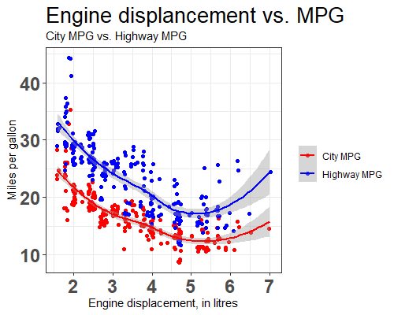

# Data visualization with ggplot2 II

* https://youtu.be/61JwzVolWgM

## Statstics and positions 

앞서 smoothing 곡선은 실제 데이터에서 관측된 값이 아닌 계산된 값을 그래프에 표현한 것 입니다. 막대그래프에서도 y축 count 값은 관측된 값이 아닌 빈도수를 계산한 값이고 boxplot의 경우도 중간값 1,3사분위수 등 통계량을 표현해 주는 그래프 입니다. 이는 대부분 통계 분석용 소프트웨어에서 제공되는 기능으로 통계량을 가시화 해주는 역할을 합니다. `ggplot2`에서도 각 geom 레이어에 `stat`이라는 옵션을 통해 이러한 통계량을 그래프로 표현할 수 있습니다. 예를 들어 앞서 생성한 키, 몸무게 데이터에서 키의 분포를 보기 위한 히스토그램을 그리면 `geom_histogram`을 사용할 수 있고 이 레이어의 `stat` 옵션의 기본값은 `"bin"` 입니다 (`?geom_histogram` 참고). 


```{r, eval=F}
library(tidyverse)

weights <- rnorm(200, 75, 5)
heights <- weights + rnorm(200, 100, 5)
classes <- sample(c("A", "B", "C", "D"), size=length(heights), replace = T)
mydata <- data.frame(heights, weights, classes)
str(mydata)

ggplot(mydata, aes(x=heights)) +
  geom_histogram()
```


경고 문구의 `bins=30`은 기본 `stat`옵션이 `bin`인데 `bins`옵션은 null로 되어 있기 때문에 경고가 발생한 것이고 30으로 강제 할당해서 그린다는 메세지 입니다. bins 옵션을 다르게 해서 테스트 해보시기 바랍니다. 또한 `stat="identity"`로 그래프를 그린 경우는 데이터 값을 그대로 그린다는 것도 다시 기억해 보시기 바랍니다. 

```{r, eval=F}
ggplot(mydata, aes(x=heights)) +
  geom_histogram(stat="identity")

ggplot(mydata, aes(x=heights, y=weights)) +
  geom_histogram(stat="identity")

```

또 다른 예를위해 앞서 키 몸무게 데이터에 혈액형 변수를 추가해 보겠습니다. 혈액형은 위 4개 학급에 관계 없이 A, B, O, AB 네 그룹으로 나눌 수 있으며 200명의 학생들에게 랜덤하게 할당하도록 합니다. 

```{r, eval=F}
bloodtype <- sample(c("A", "B", "O", "AB"), nrow(mydata), replace=T)
mynewdata <- data.frame(mydata, bloodtype)
str(mynewdata)
```

위와 같이 새로운 변수 bloodtype 이 `factor`형으로 추가되어 새로운 `data.frame`을 생성하도록 했습니다. 이제 각 학급별로 몇 명의 혈액형 타입을 갖는 학생들이 있는지를 막대그래프로 표현해 보도록 하겠습니다. 혈액형의 타입별로 다른 색으로 막대를 칠하도록 해봅니다. 막대그래프의 색은 `fill`옵션으로 채울수 있고 막대그래프는 `geom_bar`그리고 이 레이어의 `stat`은 기본값이 `count`이므로 따로 명시하지 않은채로 다음과 같이 코드를 작성할 수 있습니다.  

```{r, eval=F}
ggplot(mynewdata, aes(x=classes, fill=bloodtype)) +
  geom_bar()
```

그런데 위와같이 그래프가 위로 쌓여서 보입니다. 이는 `geom_bar`의 `position` 기본값이 `stack`으로 되어있어서 보이는 현상입니다 (`?geom_bar`참고). 옆으로 나란히 막대를 위치시킨 후 크기를 비교하기 위해서 `position="dodge"`를 사용합니다. 또한 막대그래프에 칠해지는 색의 투명도를 `alpha` 옵션을 사용해 변경할 수 있습니다. 

```{r, eval=F}
ggplot(mynewdata, aes(x=classes, fill=bloodtype)) +
  geom_bar(alpha=0.5, position="dodge")
```

다음과 같이 간단히 한 줄만 추가하여 위 막대그래프의 위치를 가로로 전환하거나 Coxcomb chart로 그릴수도 있습니다. 

```{r, eval=F}
ggplot(mynewdata, aes(x=classes, fill=bloodtype)) +
  geom_bar(position="dodge") +
  coord_flip()
```

```{r, eval=F}
ggplot(mynewdata, aes(x=classes, fill=bloodtype)) +
  geom_bar(position="dodge") +
  coord_polar()
```


참고로 위 Coxcomb 그래프의 경우는 해석이 어렵거나 x, y축의 라벨링에 혼돈이 올수 있으니 정보 전달이 명확하도록 그래프의 옵션들을 추가하거나 용도에 맞게 사용할 필요가 있습니다. 


## Facets

산점도의 예에서 위와 같이 다른 색이나 모양으로 그리기 보다는 종 별로 다른 켄버스에 별도의 산점도를 그려야 할 경우가 있습니다. 이럴때 사용하는 함수가 `facet_wrap()`이나 `facet_grid()` 입니다. 보통 범주형 자료에 대해서 적용할 수 있으며 `facet_wrap()`은 하나의 변수에 대해서 그림을 나눠그릴때 사용하고 `facet_grid()`는 두 개 변수의 조합에 의한 그래프들을 그릴 때 사용합니다.  위 붓꽃 예에서는 3가지 종을 나타내는 변수 `Species`를 이용하면 되겠습니다. `facet_wrap()`함수에는 `~`를 이용한 formula를 사용합니다. 

```{r, eval=F}

ggplot(iris, aes(x=Petal.Length, y=Petal.Width)) + 
  geom_point(aes(color=Species, shape=Species)) +
  facet_wrap(~Species, nrow=2)

```


만약 두 개의 범주형 변수에 대해서 x, y축 각각으로 나누고 싶을 때는 `facet_grid()`를 사용할 수 있습니다.  `iris` 데이터는 하나의 범주형 변수와 네 개의 숫자형 변수로 구성되어 있습니다 (`str(iris)` 확인). 여기에 랜덤하게 0과 1을 갖는 범주형 변수 하나를 추가해 보겠습니다. 


```{r, eval=F}
str(iris)
mycate <- sample(c(0,1), nrow(iris), replace=T)
myiris <- data.frame(iris, mycate)
str(myiris)
```

이제 mycate와 Species 두 범주형 변수에 대해서 facet 그래프를 그려보면 다음과 같습니다. `facet_grid()`함수를 사용하면 되며 x와 y축의 변수는 `~`를 활용한 formula를 사용합니다. 즉 `~` 왼편의 변수는 y축 오른편의 변수는 x축으로 구성되어집니다. 새로운 `myiris`라는 데이터를 만들었으므로 iris 대신 myiris를 사용합니다. 


```{r, eval=F}
ggplot(myiris, aes(x=Petal.Length, y=Petal.Width)) + 
  geom_point(aes(color=Species, shape=Species)) +
  facet_grid(Species~mycate)
```


만약 하나의 변수에 대해서 x축이나 y축 하나에만 나열하고 싶은 경우 다음처럼 `.` 을 사용하면 됩니다. 


```{r, eval=F}
ggplot(myiris, aes(x=Petal.Length, y=Petal.Width)) + 
  geom_point(aes(color=Species, shape=Species)) +
  facet_grid(.~mycate)

ggplot(myiris, aes(x=Petal.Length, y=Petal.Width)) + 
  geom_point(aes(color=Species, shape=Species)) +
  facet_grid(Species~.)

ggplot(myiris, aes(x=Petal.Length, y=Petal.Width)) + 
  geom_point(aes(color=Species, shape=Species)) +
  facet_grid(.~Species)

```


### Exercise{#ex10.1}

`Orange` 데이터셋은 다섯 그루의 오랜지 나무에 대한 시간에(age-days) 따른 성장을(circumference) 기록한 데이터임. 

1) age와 circumference 를 각각 x와 y축으로 하는 산점도를 그리는 코드를 작성하시오 (ggplot 이용, 나무별로 다른 색 사용) 

```{r, eval=T, echo=F}
library(ggplot2)
ggplot(Orange, aes(x=age, y=circumference)) + geom_point(aes(color=Tree))
```

2) 나무별로 다른 켄버스에 age와 circumference를 x와 y축으로 하는 산점도를 그리는 코드를 작성하시오 (ggplot, facet_grid이용)

```{r, eval=T, echo=F}
ggplot(Orange, aes(x=age, y=circumference)) + 
  geom_point(aes(color=Tree)) +
  facet_grid(.~Tree)
```

3) 2)에서 그려진 나무별 산점도에 다음과 같이 선분을 추가한 그래프를 그리는 코드를 작성 하시오 

```{r, eval=T, echo=F}
ggplot(Orange, aes(x=age, y=circumference)) + 
  geom_point(aes(color=Tree), size=3) +
  geom_line(aes(color=Tree)) +
  facet_grid(.~Tree)
```


### Exercise{#ex10.2}

`InsectSprays`는 제초제의 효능에 관한 데이터이다. 다음과 같은 plot을 그리는 코드를 작성 하시오

```{r, eval=T, echo=F}
library(ggplot2)
ggplot(InsectSprays, aes(x=count, fill=spray)) +
  geom_bar(stat="bin", bins=10) +
  facet_grid(spray~.) +
  ylab("Spray brand") + 
  xlab("Count of insects") + 
  ggtitle("Effectiveness of Insect Sprays")
```


## Themes, Labels, and Scales

Theme은 data관련 요소들 외의 것들에 대한 설정을 위해서 사용됩니다. 즉, 제목이나 라벨, 배경, 범례 등의 색, 위치, 크기, 모양 등을 설정하는데 사용합니다. 주의할 부분은 해당 택스트 등 데이터를 변경하는 것이 아니고 보여지는 모습만을 바꿀 수 있다는 것 입니다. 택스트 설정은 `labs`를 사용합니다. 예제를 가지고 몇 가지 실습을 해 보겠습니다. 먼저 `labs`라는 명령어로 x축, y축, Title 등을 설정할 수 있습니다. 참고로 `xlab()`, `ylab()` 등의 함수도 x축, y축 라벨을 설정하는데 사용될 수 있지만 여기서는 `labs`만을 사용하도록 합니다. 


```{r, eval=F}
ggplot(mynewdata, aes(x=classes, fill=bloodtype)) +
  geom_bar(position="dodge") +
  labs(x='Four classes',
       y='Number of students',
       title='Blood type distribution',
       subtitle = 'Blood type distribution from the 200 students',
       fill='Blood Types') 
```

위 코드에서 `labs`에서 설정할 수 있는 옵션은 `title`, `subtitle`과 x축, y축 라벨 그리고 범례의 title까지 가능합니다. 특히 `ggplot` 명령에서 `aes(fill=bloodtype)`이 사용되었으므로 범례의 title은 `fill="Blood types"`로 설정해야 하며 만약 `aes(color=bloodtype)`으로 사용되었을 경우에는 `color="Blood types"`으로 설정합니다. 참고로 범례의 label을 설정하는 방법은 다음과 같이 `scale_fill_discrete` 함수의 `labels` 옵션을 사용하면 됩니다. `element_blank()`는 택스트를 공백으로 설정할 때 사용합니다. 아래 나올 `scale` 관련 내용과 함께 이해하시면 좋습니다. 

```{r, eval=F}
ggplot(mynewdata, aes(x=classes, fill=bloodtype)) +
  geom_bar(position="dodge") +
  scale_fill_discrete(name=element_blank(), labels=c("A type", "AB type", "B type", "O type"))
```


이제 본격적으로 Theme으로 그래프를 장식해 보도록 합니다. `Theme` 관련된 옵션들은 https://ggplot2.tidyverse.org/reference/theme.html 이곳을 참고하시기 바랍니다. 여기서 mapping은 그대로인채로 모양 등의 설정을 바꿔가면서 그래프의 형태를 확인하는 작업이 반복되므로 다음과 같이 `myplot`이라는 변수에 기본이 되는 ggplot 코드를 저장하고 이후 `+` 연산자를 사용해서 옵션을 바꿔가며 편리하게 코드를 재사용 할 수도 있습니다. 

```{r, eval=F}
myplot <- ggplot(mynewdata, aes(x=classes, fill=bloodtype)) +
  geom_bar(position="dodge") +
  labs(x='Four classes',
       y='Number of students',
       title='Blood type distribution',
       subtitle = 'Blood type distribution from the 200 students',
       fill='Blood Types') 
myplot + theme_bw()
```

위 `theme_bw()` 함수는 theme의 세부 사항 몇 가지를 미리 설정해 놓아서 (배경을 white 색, 눈금을 회색으로 바꾸는 등) theme 설정을 위한 일련의 과정을 한번에 수행하도록 만든 함수 입니다. theme을 이용한 설정은 plot, axis, legend, panel, facet 등에 적용할 수 있으며 따라서 다음 코드와 같이 해당하는 요소를 참고할 때 `.` 기호로 구분된 옵션 이름을 사용합니다. 값을 지정할 때에는 `element_xxx`의 패턴으로 이루어진 함수를 사용합니다. 다음은 각각 plot과 panel 배경색을 바꾸는 코드 입니다. 

```{r, eval=F}
myplot + theme(plot.background = element_rect(fill="gray"))
```

```{r, eval=F}
myplot + theme(panel.background = element_rect(fill="gray"))
```

```{r, eval=F}
myplot + 
  theme(
    panel.background = element_rect(fill="gray"),
    plot.background = element_rect(fill="gray")
    )
```


또한 축이나 라벨 택스트의 모양도 바꿀 수 있습니다. 

```{r, eval=F}
myplot + 
  theme(
    axis.line = element_line(arrow = arrow(angle = 15, length = unit(.15,"inches"))),
    axis.text = element_text(face = "bold", size = 12, angle = 30),
    axis.text.x = element_text(color="blue", size=18)
    )
```


```{r, eval=F}
myplot + 
  theme(
    plot.title=element_text(size=18, face = "bold", color="red", hjust=0.5),
    plot.subtitle = element_text(size=18, face = "bold", color="gray")
    )
```


위 예제 외에도 다양한 그래프를 그릴 수 있으며 모든 사용법을 외워서 사용하기 보다는 사용할 때 마다 필요한 함수와 옵션을 찾아서 사용하다 보면 점차 익숙해질 것 입니다. 가장 정확한 참고 자료는 공식 reference 페이지를 참고하면 좋으며 https://ggplot2.tidyverse.org/reference/index.html 이 외에도 다른 사람들이 만들어 놓은 그래프를 https://exts.ggplot2.tidyverse.org/ 참고해서 원하는 목적에 맞는 코드를 가져다 사용할 수 있습니다. 

본 장에서 마지막으로 소개할 내용은 `Scale` 입니다. 앞서 어떤 데이터를 x축, y축 또는 group이나 color로 맵핑할지를 결정하는 함수가 `aes`였다면 scale은 어떻게 (위치, 색상, 크기, 모양 등) 맵핑할 것인가를 설정하는 방법입니다. 함수 형태는 `scale_<aesthetic>_<type>` 이며 `<aesthetic>`과 `<type>`에 해당하는 (미리 지정된) 단어를 넣어주면 되겠습니다. 예를 들어 앞서 예제에서 `fill=bloodtype`로 혈액형 데이터를 막대그래프의 색을 칠하는데 사용했다면 `scale_fill_manual` 함수로 어떤 색을 칠할지를 정해주는 방식입니다. 다음 몇 가지 예를 실습해 보고 이해해 봅니다. 

```{r, eval=F}
myplot + 
  scale_fill_manual(values = c("orange", "skyblue", "royalblue", "blue"))

myplot + 
  scale_fill_brewer(palette="BrBG")
```

두 번째 `scale_fill_brewer`의 경우는 `brewer`라는 (https://colorbrewer2.org/) 미리 지정된 색의 조합을 가져와 사용하는 방식입니다. `?scale_fill_brewer`의 Palettes 섹션을 보시면 사용 가능한 팔레트의 이름이 나와 있으며 위 예제 에서는 BrBG라는 이름의 팔레트를 사용했습니다. 아래는 viridis 라는 이름의 팔레트이며 (https://bids.github.io/colormap/) 이러한 팔레트는 R 뿐만 아니라 python, Matlab 등의 다른 프로그래밍 언어에서도 사용할 수 있도록 라이브러리를 제공하고 있습니다. 


```{r, eval=F}
myplot + 
  scale_fill_viridis_d()
```

참고로 앞서 설명한 바와 같이 `aes(fill=bloodtype)`이 사용되었으므로 `scale_fill_viridis_d`을 사용했으며 만약 `aes(color=bloodtype)`으로 사용되었을 경우에는 이에 맞는 `scale_fill_viridis_d`으로 설정해야 합니다. 맵핑된 데이터가 연속형일 경우에는 (위 학급 예제의 혈액형은 4개의 혈액형으로 나뉘는 범주형  데이터임) `scale_fill_gradient`, `scale_fill_distiller` 등의 연속형 데이터에 맞는 scale 함수를 사용해야 합니다. 또한 데이터의 스케일이 log나 지수 단위일 경우에도 일 때에도 `scale_x_log10()` 등의 함수를 이용해서 x축 또는 y축의 스케일을 변경해줄 수 있습니다. 다음은 간단한 형태의 로그 분포 데이터를 생성하고 히스토그램을 그리는 코드입니다. 


```{r, eval=F}
mydf <- data.frame(x=rlnorm(1000, log(10), log(2.5)))
p <- ggplot(mydf, aes(x=x)) +
  geom_histogram()
p
```


위 히스토그램의 x축을 로그 스케일로 전환하고자 할 때 다음과 같이 `scale_x_log10()` 함수를 추가하면 됩니다.

```{r, eval=F}
p + scale_x_log10()
```

### Exercise{#ex10.3}

`mpg` 데이터셋은 38종 자동차의 연비 데이터임. 이 데이터셋을 이용하여 다음 그래프를 그리시오

1) 엔진 배기량과 (displ) 도심연비 (cty)를 비교하는 산포도를 그리고 어떤 연관성이 있는지 설명하시오

```{r, eval=F, echo=F}
ggplot(mpg, aes(x=displ, y=cty))+
  geom_point()
```


2) 위 산포도의 점들은 실제로는 한 개 이상의 데이터가 겹쳐셔 표현된 경우가 많음. ggplot2에서는 이러한 문제를 극복하기 위해서 `position="jitter"` 라는 옵션을 사용할 수 있음. 이 옵션을 적용한 코드를 작성하시오.

```{r, eval=F, echo=F}
ggplot(mpg, aes(x=displ, y=cty)) +
  geom_point(position="jitter")
```


3) 위 그래프에 배기량과 (displ) 고속도로연비 (hwy) 산포도를 추가하여 다음과 같이 `scale_color_manual()` 함수를 사용해서 "red"와 "blue"로 점들을 표현한 그래프를 그리시오.

```{r, eval=F}

mydf <- data.frame(displ=mpg$displ, cty=mpg$cty, hwy=mpg$hwy) %>% 
  pivot_longer(cols=c("cty", "hwy"), names_to="type")
str(mydf)

```

```{r, eval=F, echo=F}
ggplot(mydf, aes(x=displ, y=value, color=type)) + 
  geom_point(position="jitter") +
  scale_color_manual(values=c("red", "blue"))
```


```{r, eval=F, echo=F}
ggplot(mpg)+
  geom_point(aes(x=displ, y=cty), color="red", position="jitter") +
  geom_point(aes(x=displ, y=hwy), color="blue", position="jitter") 
```


4) 다음과 같이 배기량과 고속도로/도심 연비의 관계를 나타내는 추세선을 추가하시오 (`geom_smooth` 이용)


```{r, eval=F, echo=F}
ggplot(mydf, aes(x=displ, y=value, color=type)) + 
  geom_point(position="jitter") +
  scale_color_manual(values=c("red", "blue")) +
  geom_smooth()
```


5) 아래 그림과 같이 Theme을 `theme_bw()`를 사용하고 추가로 Title, subtitle, x축, y축 라벨, 그리고 범례의 Title을 변경하시오. (범례의 라벨 설정은 `scale_color_manual`에서 `labels=c("City MPG", "Highway MPG")`으로 설정,  범례의 title을 지울때는  `name=element_blank()`, Title의 택스트 크기는 20, x축, y축의 라벨 텍스트 크기는 18로 설정)



```{r, eval=F, echo=F}
ggplot(mydf_mlt, aes(x=displ, y=value, color=variable)) + 
  geom_point(position="jitter") +
  scale_color_manual(name=element_blank(), 
                     values=c("red", "blue"), 
                     labels=c("City MPG", "Highway MPG")) +
  geom_smooth() +
  labs(x='Engine displacement, in litres',
       y='Miles per gallon',
       title='Engine displancement vs. MPG',
       subtitle = 'City MPG vs. Highway MPG') +
  theme_bw() +
  theme(
    plot.title = element_text(size=20),
    axis.text = element_text(face = "bold", size = 18)
  ) 
```


---


<a rel="license" href="http://creativecommons.org/licenses/by-nc-nd/4.0/"></a><br />이 저작물은 <a rel="license" href="http://creativecommons.org/licenses/by-nc-nd/4.0/">크리에이티브 커먼즈 저작자표시-비영리-변경금지 4.0 국제 라이선스</a>에 따라 이용할 수 있습니다.

