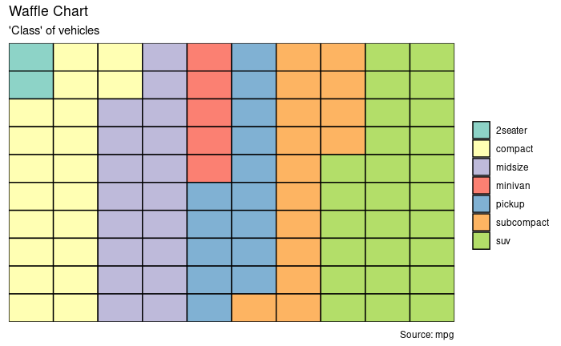
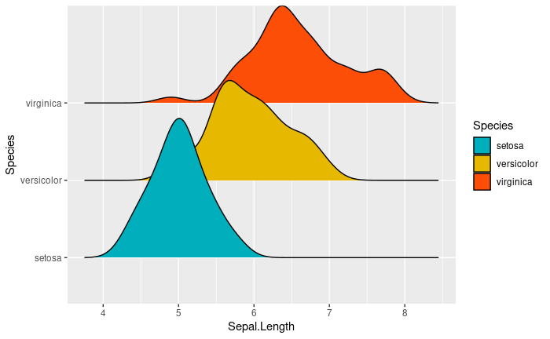

# ggplot2 examples 

* https://youtu.be/v-8ri9oxZUo


인터넷에서 찾은 다음 사이트의 예제를 보면서 다양한 그래프 예제를 실행해 보겠습니다. 코드는 조금씩 변형된 부분이 있으니 참고 부탁 드립니다.

* https://www.r-graph-gallery.com/ggplot2-package.html
* http://r-statistics.co/Top50-Ggplot2-Visualizations-MasterList-R-Code.html
* https://www.datanovia.com/en/blog/ggplot-examples-best-reference/


## Violin plot 

* https://www.r-graph-gallery.com/violin_and_boxplot_ggplot2.html


```{r, eval=F}
library(tidyverse)
library(viridis)

# create a dataset
data <- data.frame(
  name=c( rep("A",500), rep("B",500), rep("B",500), rep("C",20), rep('D', 100)  ),
  value=c( rnorm(500, 10, 5), rnorm(500, 13, 1), rnorm(500, 18, 1), rnorm(20, 25, 4), rnorm(100, 12, 1) )
)

data %>% str

ggplot(data, aes(x=name, y=value, fill=name)) +
    geom_violin(width=1.4) +
    geom_boxplot(width=0.1, alpha=0.2) 

# sample summary
sample_size = data %>% 
  group_by(name) %>% 
  summarize(num=n()) 

xlab <- sample_size %>% 
  apply(1, function(x)paste0(x, collapse="\n n="))

apply(sample_size, 1, function(x)paste0(x, collapse="\n n="))

ggplot(data, aes(x=name, y=value, fill=name)) +
    geom_violin(width=1.4) +
    geom_boxplot(width=0.1, alpha=0.2) +
    scale_fill_viridis(discrete = TRUE) +
    scale_x_discrete(labels=xlab) +
    theme(
      legend.position="none",
      plot.title = element_text(size=11)
    ) +
    ggtitle("A Violin wrapping a boxplot") +
    xlab("")
```


## Bubble plot

* https://www.r-graph-gallery.com/320-the-basis-of-bubble-plot.html


```{r, eval=F}
mpg %>% str

# Most basic bubble plot
ggplot(mpg, aes(x=cty, y=displ, size = hwy)) +
  geom_point(alpha=0.7, position="jitter") 
```


```{r, eval=F}
ggplot(mpg, aes(x=cty, y=displ, size = hwy)) +
  geom_point(alpha=0.3, position="jitter") +
  scale_size(range = c(.1, 7), name="")
```


```{r, eval=F}
ggplot(mpg, aes(x=cty, y=displ, size = hwy, color=year)) +
  geom_point(alpha=0.3, position="jitter") +
  scale_size(range = c(.1, 7), name="")
```


```{r, eval=F}
mpg %>% 
  mutate(yearf = factor(year)) %>% 
  ggplot(aes(x=cty, y=displ, size=hwy, color=yearf)) +
  geom_point(alpha=0.3, position="jitter") +
  scale_size(range = c(.1, 7), name="") 
```


```{r, eval=F}
mpg %>% 
  mutate(yearf = factor(year)) %>% 
  ggplot(aes(x=cty, y=displ, size=hwy, fill=yearf)) +
  geom_point(alpha=0.5, position="jitter", shape=21) +
  scale_size(range = c(.1, 7), name="") + 
  scale_fill_viridis(discrete=TRUE, guide=FALSE, option="D") +
  theme_bw() +
  ylab("Engine displacement") +
  xlab("City miles per gallon") +
  theme(legend.position = "none")

```


## Barplot with errorbars


```{r, eval=F}
ToothGrowth %>% str

df <- ToothGrowth %>% 
  mutate(dose = as.factor(dose))
df %>% str

## summary
df_summary <- df %>%
  group_by(dose) %>%
  summarise(sd = sd(len, na.rm = TRUE), len = mean(len))
df_summary


ggplot(df_summary, aes(x=dose, y=len, fill=dose)) +
  geom_bar(stat = "identity", color = "black", width = 0.5) +
  geom_errorbar(aes(ymin = len, ymax = len+sd), width = 0.2) 

```

## horizontal barplot


```{r, eval=F}

df <- mtcars %>%
  rownames_to_column() %>%
  as_data_frame() %>%
  mutate(cyl = as.factor(cyl)) %>%
  select(rowname, wt, mpg, cyl)
df

# change fill color by groups and add text labels
ggplot(df, aes(x = reorder(rowname, mpg), y = mpg)) +
  geom_col(aes(fill = cyl)) + 
  geom_text(aes(label = mpg), nudge_y = 2) + 
  coord_flip() +
  scale_fill_viridis_d()
```


## Circular barplot

* https://www.r-graph-gallery.com/297-circular-barplot-with-groups.html


```{r, eval=F}
# Create dataset
n <- 70
data <- data.frame(
  id = seq(1, n),
  individual=paste( "Mister ", seq(1,n), sep=""),
  group=c( rep('A', 10), rep('B', 30), rep('C', 14), rep('D', n-10-30-14)) ,
  value=sample( seq(10,100), n, replace=T)
)
data %>% str

# introduce NA
empty_bar_idx <- sample(1:n, 10)
data[empty_bar_idx,c(2:4)] <- c(NA, NA, NA)

label_data <- data
number_of_bar <- nrow(label_data)
angle <- 90 - 360 * (label_data$id-0.5) /number_of_bar     # I substract 0.5 because the letter must have the angle of the center of the bars. Not extreme right(1) or extreme left (0)
label_data$hjust <- ifelse( angle < -90, 1, 0)
label_data$angle <- ifelse(angle < -90, angle+180, angle)

data %>% 
ggplot(aes(x=as.factor(id), y=value, fill=group)) +
  geom_bar(stat="identity") +
  ylim(-100,120) +
  theme_minimal() +
  theme(
    axis.text = element_blank(),
    axis.title = element_blank(),
    panel.grid = element_blank(),
    plot.margin = unit(rep(-1,4), "cm") 
  ) +
  coord_polar(start = 0) + 
  geom_text(data=label_data, aes(x=id, y=value+10, label=individual, hjust=hjust), color="black", fontface="bold", alpha=0.6, size=2.5, angle= label_data$angle, inherit.aes = FALSE ) 
```

데이터 정렬 후 plot


```{r, eval=F}

data2 <- data %>% 
  arrange(group, value) %>% 
  mutate(id2=1:n()) 

label_data2 <- data2
number_of_bar <- nrow(label_data2)
angle <- 90 - 360 * (label_data2$id2-0.5) /number_of_bar     # I substract 0.5 because the letter must have the angle of the center of the bars. Not extreme right(1) or extreme left (0)
label_data2$hjust <- ifelse( angle < -90, 1, 0)
label_data2$angle <- ifelse(angle < -90, angle+180, angle)


data2 %>% 
  ggplot(aes(x=as.factor(id2), y=value, fill=group)) +
  geom_bar(stat="identity") +
  ylim(-100,120) +
  theme_minimal() +
  theme(
    axis.text = element_blank(),
    axis.title = element_blank(),
    panel.grid = element_blank(),
    plot.margin = unit(rep(-1,4), "cm") 
  ) +
  coord_polar(start = 0) + 
  geom_text(data=label_data2, aes(x=id2, y=value+10, label=individual, hjust=hjust), color="black", fontface="bold",alpha=0.6, size=2.5, angle= label_data$angle, inherit.aes = FALSE ) 


```


## Stacked area chart

* https://www.data-to-viz.com/caveat/stacking.html


```{r, eval=F}
library(babynames)

babynames %>% str


# Load dataset from github
data <- babynames %>% 
  filter(name %in% c("Amanda", "Jessica",    "Patricia", "Deborah",   "Dorothy",  "Helen")) %>%
  filter(sex=="F")

# Plot
p <- data %>% 
  ggplot(aes(x=year, y=n, fill=name, text=name)) +
    geom_area( ) +
    scale_fill_viridis(discrete = TRUE) +
    ggtitle("Popularity of American names in the previous 30 years") +
    theme() +
    xlab("Birth year") +
    ylab("Number of babies")
p
```


```{r, eval=F}
p + facet_wrap(~name, scale="free_y")
```

## Density plot


```{r, eval=F}
# Plot
g <- ggplot(mpg, aes(cty))
g + geom_density(aes(fill=factor(cyl)), alpha=0.8) + 
    labs(title="Density plot", 
         subtitle="City Mileage Grouped by Number of cylinders",
         caption="Source: mpg",
         x="City Mileage",
         fill="# Cylinders")
```

## Waffle chart

* http://r-statistics.co/Top50-Ggplot2-Visualizations-MasterList-R-Code.html#Waffle%20Chart

```{r, eval=F}
var <- mpg$class  # the categorical data 

## Prep data (nothing to change here)
nrows <- 10
df <- expand.grid(y = 1:nrows, x = 1:nrows)
categ_table <- round(table(var) * ((nrows*nrows)/(length(var))))
categ_table


df$category <- factor(rep(names(categ_table), categ_table))  
# NOTE: if sum(categ_table) is not 100 (i.e. nrows^2), it will need adjustment to make the sum to 100.

## Plot
df %>% str
ggplot(df, aes(x = x, y = y, fill = category)) + 
        geom_tile(color = "black", size = 0.5) 
```



```{r, eval=F}
ggplot(df, aes(x = x, y = y, fill = category)) + 
        geom_tile(color = "black", size = 0.5) +
        scale_x_continuous(expand = c(0, 0)) +
        scale_y_continuous(expand = c(0, 0), trans = 'reverse') +
        scale_fill_brewer(palette = "Set3") +
        labs(title="Waffle Chart", subtitle="'Class' of vehicles",
             caption="Source: mpg") + 
        theme(plot.title = element_text(size = rel(1.2)),
              axis.text = element_blank(),
              axis.title = element_blank(),
              axis.ticks = element_blank(),
              legend.title = element_blank(),
              legend.position = "right")
```


## Marginal histogram 


```{r, eval=F}
library(ggExtra)

# Scatterplot
p <- ggplot(mpg, aes(x=cty, y=hwy)) + 
  geom_point(position="jitter", alpha=0.5) +
  geom_smooth(method="lm", se=F) +
  theme_bw() +
  theme(
    legend.position = "none"
  ) +
  xlab("City miles per gallon") +
  ylab("Highway miles per gallon")
p
ggMarginal(p, type = "histogram", fill="transparent") 
ggMarginal(p, type = "density", fill="transparent")
```


```{r, eval=F}
library(ggpubr)
# Grouped Scatter plot with marginal density plots
ggscatterhist(
  iris, 
  x = "Sepal.Length", 
  y = "Sepal.Width",
  color = "Species", 
  size = 3, 
  alpha = 0.6,
  palette = c("#00AFBB", "#E7B800", "#FC4E07"),
  margin.params = list(fill = "Species", color = "black", size = 0.2)
  )
```


## Density ridgeline plots




```{r, eval=F}
library(ggridges)
ggplot(iris, aes(x = Sepal.Length, y = Species)) +
  geom_density_ridges(aes(fill = Species)) +
  scale_fill_manual(values = c("#00AFBB", "#E7B800", "#FC4E07"))
```


---


<a rel="license" href="http://creativecommons.org/licenses/by-nc-nd/4.0/"></a><br />이 저작물은 <a rel="license" href="http://creativecommons.org/licenses/by-nc-nd/4.0/">크리에이티브 커먼즈 저작자표시-비영리-변경금지 4.0 국제 라이선스</a>에 따라 이용할 수 있습니다.

