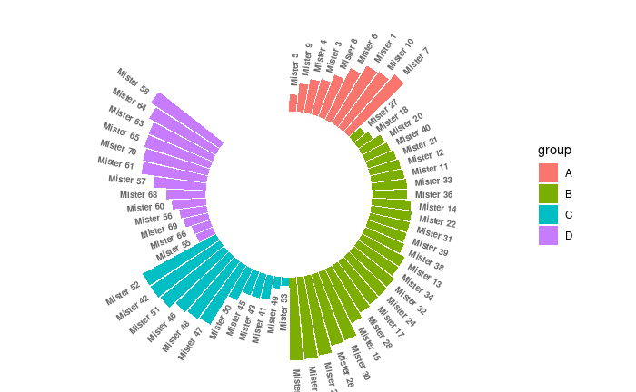

# Data visualization with ggplot2 III

* h


## ggplot2 examples 

인터넷에서 찾은 다음 사이트의 예제를 보면서 다양한 그래프 예제를 실행해 보겠습니다. 코드는 조금씩 변형된 부분이 있으니 참고 부탁 드립니다.

* https://www.r-graph-gallery.com/ggplot2-package.html
* http://r-statistics.co/Top50-Ggplot2-Visualizations-MasterList-R-Code.html
* https://www.datanovia.com/en/blog/ggplot-examples-best-reference/


### Violin plot 

* https://www.r-graph-gallery.com/violin_and_boxplot_ggplot2.html


```{r, eval=F}
library(tidyverse)
library(viridis)

# create a dataset
data <- data.frame(
  name=c( rep("A",500), rep("B",500), rep("B",500), rep("C",20), rep('D', 100)  ),
  value=c( rnorm(500, 10, 5), rnorm(500, 13, 1), rnorm(500, 18, 1), rnorm(20, 25, 4), rnorm(100, 12, 1) )
)

data %>% str

ggplot(data, aes(x=name, y=value, fill=name)) +
    geom_violin(width=1.4) +
    geom_boxplot(width=0.1, alpha=0.2) 

# sample summary
sample_size = data %>% 
  group_by(name) %>% 
  summarize(num=n()) 

xlab <- sample_size %>% 
  apply(1, function(x)paste0(x, collapse="\n n="))
  
ggplot(plotdata, aes(x=name, y=value, fill=name)) +
    geom_violin(width=1.4) +
    geom_boxplot(width=0.1, alpha=0.2) +
    scale_fill_viridis(discrete = TRUE) +
    scale_x_discrete(labels=xlab) +
    theme(
      legend.position="none",
      plot.title = element_text(size=11)
    ) +
    ggtitle("A Violin wrapping a boxplot") +
    xlab("")
```


### Bubble plot

* https://www.r-graph-gallery.com/320-the-basis-of-bubble-plot.html


```{r, eval=F}
mpg %>% str

# Most basic bubble plot
ggplot(mpg, aes(x=cty, y=displ, size = hwy)) +
  geom_point(alpha=0.7, position="jitter") 


ggplot(mpg, aes(x=cty, y=displ, size = hwy)) +
  geom_point(alpha=0.3, position="jitter") +
  scale_size(range = c(.1, 7), name="")


ggplot(mpg, aes(x=cty, y=displ, size = hwy, color=year)) +
  geom_point(alpha=0.3, position="jitter") +
  scale_size(range = c(.1, 7), name="")


mpg %>% 
  mutate(yearf = factor(year)) %>% 
  ggplot(aes(x=cty, y=displ, size=hwy, color=yearf)) +
  geom_point(alpha=0.3, position="jitter") +
  scale_size(range = c(.1, 7), name="") 


mpg %>% 
  mutate(yearf = factor(year)) %>% 
  ggplot(aes(x=cty, y=displ, size=hwy, fill=yearf)) +
  geom_point(alpha=0.5, position="jitter", shape=21) +
  scale_size(range = c(.1, 7), name="") + 
  scale_fill_viridis(discrete=TRUE, guide=FALSE, option="D") +
  theme_bw() +
  ylab("Engine displacement") +
  xlab("City miles per gallon") +
  theme(legend.position = "none")

```


### Circular barplot

* https://www.r-graph-gallery.com/297-circular-barplot-with-groups.html


```{r, eval=F}
# Create dataset
n <- 70
data <- data.frame(
  id = seq(1, n),
  individual=paste( "Mister ", seq(1,n), sep=""),
  group=c( rep('A', 10), rep('B', 30), rep('C', 14), rep('D', n-10-30-14)) ,
  value=sample( seq(10,100), n, replace=T)
)
data %>% str

# introduce NA
empty_bar_idx <- sample(1:n, 10)
data[empty_bar_idx,c(2:4)] <- c(NA, NA)

label_data <- data
number_of_bar <- nrow(label_data)
angle <- 90 - 360 * (label_data$id-0.5) /number_of_bar     # I substract 0.5 because the letter must have the angle of the center of the bars. Not extreme right(1) or extreme left (0)
label_data$hjust <- ifelse( angle < -90, 1, 0)
label_data$angle <- ifelse(angle < -90, angle+180, angle)

data %>% 
ggplot(aes(x=as.factor(id), y=value, fill=group)) +
  geom_bar(stat="identity") +
  ylim(-100,120) +
  theme_minimal() +
  theme(
    axis.text = element_blank(),
    axis.title = element_blank(),
    panel.grid = element_blank(),
    plot.margin = unit(rep(-1,4), "cm") 
  ) +
  coord_polar(start = 0) + 
  geom_text(data=label_data, aes(x=id, y=value+10, label=individual, hjust=hjust), color="black", fontface="bold",alpha=0.6, size=2.5, angle= label_data$angle, inherit.aes = FALSE ) 
```

데이터 정렬 후 plot



```{r, eval=F}

data2 <- data %>% 
  arrange(group, value) %>% 
  mutate(id2=1:n()) 

label_data2 <- data2
number_of_bar <- nrow(label_data2)
angle <- 90 - 360 * (label_data2$id2-0.5) /number_of_bar     # I substract 0.5 because the letter must have the angle of the center of the bars. Not extreme right(1) or extreme left (0)
label_data2$hjust <- ifelse( angle < -90, 1, 0)
label_data2$angle <- ifelse(angle < -90, angle+180, angle)


data2 %>% 
  ggplot(aes(x=as.factor(id2), y=value, fill=group)) +
  geom_bar(stat="identity") +
  ylim(-100,120) +
  theme_minimal() +
  theme(
    axis.text = element_blank(),
    axis.title = element_blank(),
    panel.grid = element_blank(),
    plot.margin = unit(rep(-1,4), "cm") 
  ) +
  coord_polar(start = 0) + 
  geom_text(data=label_data2, aes(x=id2, y=value+10, label=individual, hjust=hjust), color="black", fontface="bold",alpha=0.6, size=2.5, angle= label_data$angle, inherit.aes = FALSE ) 


```


## 


`dplyr`패키지를 이용해서 `iris` 품종별로 꽃과 꽃받침의 넓이와 길이의 평균을 비교하는 bar그래프를 (error bar 포함) 그려보겠습니다.


```{r, eval=F}
iris_mean <- iris %>% 
  group_by(Species) %>% 
  summarise_all(mean)


iris %>% 
  group_by(Species) %>% 
  summarise(across(everything(), mean))


iris %>% 
  group_by(Species) %>% 
  summarise(across(everything(), list(m=mean,s=sd)))


```

이제 이 값들을 이용해서 barplot으로 그려봅니다. 그래프의 x축은 species별 Length나 Width mean 값으로 하고 y축은 각 해당하는 값들로 `stat="identity"'로 넣어주면 될 듯 합니다.  ggplot을 이용해서 그래프를 그리기 위한 long형 데이터로 전환해보면 다음과 같습니다. 


```{r, eval=F}
iris_mean_mlt <- iris_mean %>% 
  pivot_longer(cols = -Species)

ggplot(iris_mean_mlt, aes(x=name, y=value, fill=Species)) +
  geom_bar(stat = "identity", position = "dodge") 

```


error bar 구현을 위해서는 각 그룹별 표준편차 `sd` 값이 필요합니다. 동일한 방법으로 sd 데이터를 구합니다. 

```{r, eval=F}
iris_sd_mlt <- iris %>% 
  group_by(Species) %>% 
  summarise_all(sd) %>% 
  pivot_longer(-Species)
```

이제 두 데이터를 병합 하겠습니다. 두 데이터를 병합할 때 key가 되는 변수가 필요하며 기본으로 동일한 이름을 가진 변수를 사용하지만 이 예제에서는 모든 변수가 동일한 이름을 가지고 있습니다. 따라서 by라는 옵션으로 key 변수를 지정해줄 수 있으며 다음과 같이 두 개 이상의 변수도 지정할 수 있습니다. 

```{r, eval=F}
iris_new <- left_join(iris_mean_mlt, iris_sd_mlt, by=c("Species", "name")) 
head(iris_new)
```

위와 같이 각 해당하는 샘플의 mean과 sd 값을 직접 비교해 보면 적절한 value 값들이 병합된 것을 알 수 있습니다. 단, `value`라는 변수 이름이 두 테이블에서 동일하게 사용되어 병합될 경우 value.x, value.y와 같이 자동으로 변수 이름이 다르게 할당 됩니다. 이제 위 데이터를 이용해서 barplot을 그려 보겠습니다. 

```{r, eval=F}
ggplot(iris_new, aes(x=name, y=value.x, fill=Species)) +
geom_bar(stat="identity", position="dodge") 

```


여기에 error bar를 추가하기 위해서는 다음과 같이 `geom_errorbar`라는 함수를 사용할 수 있습니다.  아래에서 `position_dodge(0.9)`는 error bar의 위치를 맞추기 위한 옵션으로 width를 사용할 경우는 일반적으로 `position_dodge(0.9)`를 사용한다고 외우는 것도 괜찮습니다. 


```{r, eval=F}

ggplot(iris_new, aes(x=name, y=value.x, fill=Species)) +
  geom_bar(stat="identity", position="dodge") +
  geom_errorbar(aes(ymin=value.x-value.y, ymax=value.x+value.y), 
              position=position_dodge(0.9),
              width = 0.4)

```


---


<a rel="license" href="http://creativecommons.org/licenses/by-nc-nd/4.0/"></a><br />이 저작물은 <a rel="license" href="http://creativecommons.org/licenses/by-nc-nd/4.0/">크리에이티브 커먼즈 저작자표시-비영리-변경금지 4.0 국제 라이선스</a>에 따라 이용할 수 있습니다.

