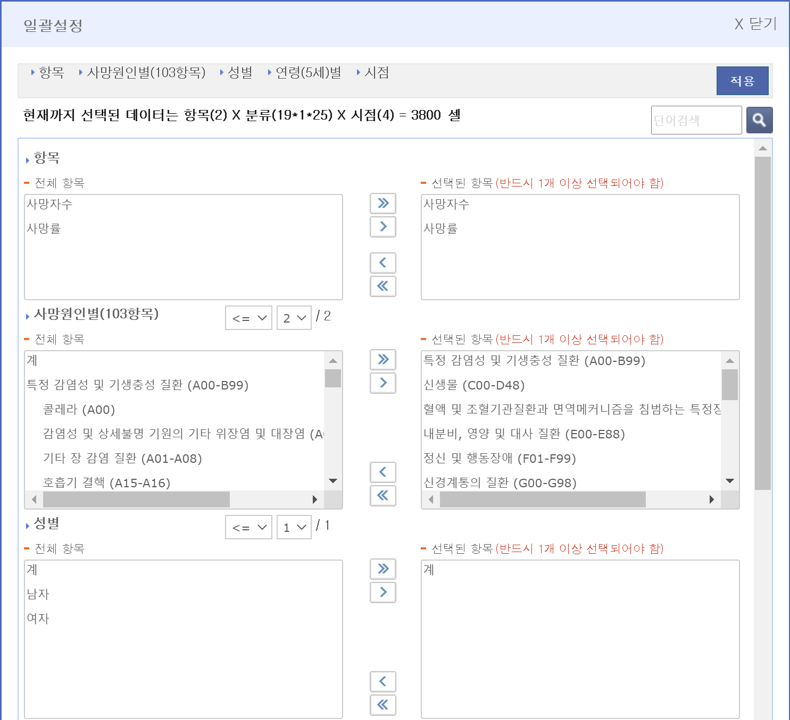

# Data analysis with rmarkdown 

* https://youtu.be/mA1y6CWOBsU

**과제 관련 공지** 

이번 과제는 rmarkdown 파일을 만드시고 아래 분석 내용을 그대로 따라하셔서 해당 Rmd 파일과 render을 수행한 pdf파일을 조교에게 보내주시면 되겠습니다. 잘 안되는 분들은 할 수 있는만큼 해보시고, 혹시 pdf 파일로 rendering이 되지 않는 분들은 Rmd 파일만이라도 보내주세요. 


## YAML data


~~~
---
title: "Analysis example"
author: "Haseong Kim"
output:
  pdf_document:
    latex_engine: xelatex
    toc: yes
    number_sections: TRUE
  html_document: 
    toc: yes
    number_sections: TRUE
mainfont: NanumGothic
---
~~~


## Objectives

국가통계포털의 사망원인/성/연령별 사망자수, 사망률 데이터 분석

- **사망원인**에 따른 **연도별** **사망율** 비교 
- **나이별** 사망율이 가장 높은 사망원인 탐색


## Data download

[국가통계포털](https://kosis.kr/index/index.do) 사이트에서 국내통계 > 주제별통계 > 보건 > 사망원인통계 > 사망원인(103항목)/성/연령(5세)별 사망자수, 사망률 > 일괄설정 > 아래와같이 설정 > 적용 > 다운로드 

{width=50%}
{width=50%}


다운로드한 excel 파일은 data 디렉토리에 `cause_of_death.xlsx`라는 이름으로 저장 


## Load excel data

```{r, eval=F}
library(readxl)

dat <- read_excel("data/cause_of_death.xlsx")

str(dat)

```

## Preprocessing 


### 변수 이름 재설정 

```{r, eval=F}
library(tidyverse)


names(dat) <- c("CoD", "Gender", "Age", "n1989", "r1989", "n1999", "r1999", "n2009", "r2009", "n2019", "r2019")

dat %>% str

dat2 <- dat %>% 
  select(CoD, Age, r1989, r1999, r2009, r2019) %>% 
  slice(-1)
str(dat2)
```

### 데이터 변환

CoD (cause of death) 변수의 NA 값 처리, Age 변수 Factor형 변환, rxxxx 변수들의 numeric 형 변환 일괄 처리  

```{r, eval=F}

cod <- dat2$CoD[!is.na(dat2$CoD)]

dat3 <- dat2 %>% 
  mutate(cod2 = cumsum(!is.na(CoD))) %>% 
  mutate(CoD = factor(cod[cod2])) %>% 
  mutate(Age = factor(Age)) %>% 
  mutate(across(starts_with("r"), as.numeric)) %>% 
  select(-cod2) %>% 
  drop_na

str(dat3)
```

### tidy 데이터 변환


```{r, eval=F}

dat4 <- dat3 %>% 
  pivot_longer(cols = starts_with("r"), 
               names_to = "year", 
                values_to = "death_rate") %>% 
  mutate(year=factor(gsub(pattern = "r", "", year)))
  
str(dat4)
```


## 그래프 분석

### 사망원인에 따른 연도별 사망율 비교 

```{r, dev="cairo_pdf", eval=F}

ggplot(dat4, aes(x=year, y=death_rate)) +
  geom_bar(stat="identity") +
  facet_wrap(CoD~.)

```


```{r, dev="cairo_pdf", eval=F}
ggplot(dat4, aes(x=year, y=death_rate, fill=CoD)) +
  geom_bar(stat="identity", position="dodge") 
```


```{r, dev="cairo_pdf", fig.width=10, fig.height=8, eval=F}

cod2 <- lapply(strsplit(cod, split=" \\("), function(x){x[1]}) %>% unlist


dat4 %>% 
  mutate(CoD = factor(CoD, labels = cod2)) %>% 
  ggplot(aes(x=year, y=death_rate, fill=year)) +
  geom_bar(stat="identity", width = 0.6) +
  facet_wrap(CoD~., 
             nrow=4, 
             scales = "free_y", 
             labeller = label_wrap_gen(width=30)) +
  theme_bw() +
  theme(strip.background =element_rect(fill="#eeeeee")) +
  scale_fill_viridis_d(name="Year") +
  xlab("Year") +
  ylab("Death Rate") +
  ggtitle("사망원인에 따른 연도별 사망율")

```

## 나이별 사망율이 가장 높은 사망원인 탐색

```{r, dev="cairo_pdf", eval=F}

ggplot(dat4, aes(x=CoD, y=death_rate)) +
  geom_bar(stat="identity") +
  facet_wrap(Age~.)

```

```{r, dev="cairo_pdf", , fig.width=10, fig.height=9, eval=F}

cod2 <- lapply(strsplit(cod, split=" \\("), function(x){x[1]}) %>% unlist

dat4 %>% 
  mutate(CoD = factor(CoD, labels = cod2)) %>% 
  ggplot(aes(x=CoD, y=death_rate, fill=year)) +
  geom_bar(stat="identity", width = 0.6, position="dodge") +
  facet_wrap(Age~., 
             nrow=6, 
             scales = "free", 
             labeller = label_wrap_gen(width=30)) +
  theme_bw() +
  theme(strip.background =element_rect(fill="#eeeeee")) +
  scale_fill_viridis_d(name="Year") +
  xlab("Year") +
  ylab("Death Rate") +
  ggtitle("나이별 사망원인")

```

```{r, dev="cairo_pdf", , fig.width=10, fig.height=9, eval=F}
dat4 %>% 
  mutate(CoD = factor(CoD, labels = cod2)) %>% 
  ggplot(aes(x=death_rate, y=CoD, fill=year)) +
  geom_bar(stat="identity", width = 0.6, position="dodge") +
  facet_wrap(Age~., 
             nrow=3, 
             scale = "free_x", 
             labeller = label_wrap_gen(width=30)) +
  theme_bw() +
  theme(strip.background =element_rect(fill="#eeeeee"),
        axis.text.x = element_text(angle = 90, vjust = 0.5, hjust=1)
        ) +
  scale_fill_viridis_d(name="Year") +
  xlab("Year") +
  ylab("Death Rate") +
  ggtitle("나이별 사망원인") 

```


