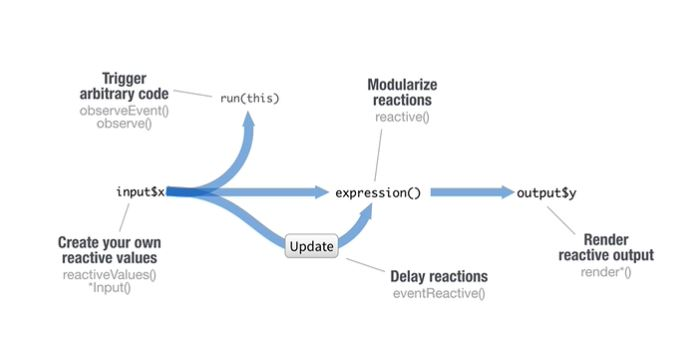
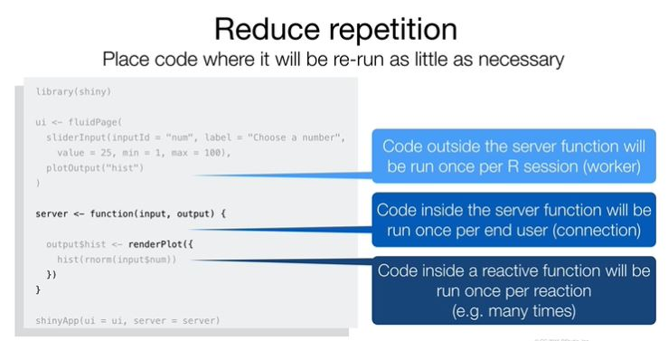

# Shiny

샤이니 [function references](https://shiny.rstudio.com/reference/shiny/1.6.0/)

# UI 

Shiny의 Architecture 는 일반적으로 사용자의 입력을 받는 부분과 특정 기능을 수행한 후 그래프를 보여주는 페이지로 나눌 수 있습니다. 모든 샤이니 엡은 R 기반으로 돌아갑니다. 

사용자 인터페이스는 html/css 로 되어 있으며 서버측은 R로 되어 있습니다.  UI 컴포넌트는 아래와 같이 실행하면 html 을 만들어줍니다. 가장 간단한 웹 페이지는 다음과 같습니다. 


```{r, eval=F}

# Define UI for application that draws a histogram
ui <- fluidPage()

ui <- fluidPage("Hello world")

# Define server logic required to draw a histogram
server <- function(input, output) {}

shinyApp(ui = ui, server = server)

```


## Input and Output

UI 함수에서는 Input 과 Output 두 가지 요소가 필요합니다. 

Input은 사용자의 입력을 받는 부분으로 html의 버튼이나 체크박스, 슬라이드바, 텍스트필드 등에 대한 인터페이스를 제공합니다. 슬라이드바의 경우 아래와 같은 파라메터를 가지며 중요한 파라메터는 inputId와 label 입니다.다른 추가적인 파라메터가 필요합니다. 사용 가능한 Input 오브젝트들은 [function references](https://shiny.rstudio.com/reference/shiny/1.6.0/)의 UI Inputs를 참고하시면 되겠습니다. 


```{r, eval=F}
sliderInput(inputId="num", label="choose", min=0, max=10, value=1)
```


Output 함수들은 역시 reference를 참고하며 plot이나 이미지, 텍스트 등의 출력을 담당하는 기능을 합니다. 뒷쪽에 Output이라는 surfix가 붙으며 중요한 파라메터는 outputId 입니다. 

```{r, eval=F}
plotOutput(outputId ="hist")
```

그래서 fluidPage() 함수에 argument 형태로 전달해 주며 xxxInput() 함수와 xxxOutput() 함수를 적절히 입력 후 서버 함수에서 두 관계를 설정해 주면 되겠습니다. 


# Server

서버 함수에서는 input과 output을 메개변수로 가지며 output$xxx 형태로 오브젝트를 저장해 줍니다.  입력값은 input$bins 형태로 값을 받아오고 이 후 이 경우 renderxxx() 형태의 함수를 이용해서 우리가 원하는 output 을 만들어 주도록 합니다. 

```{r, eval=F}
server <- function(input, output) {

    output$distPlot <- renderPlot({
        bins <- seq(min(x), max(x), length.out = input$bins + 1)
        hist(x, breaks = bins, col = 'darkgray', border = 'white')
    })
}
```

서버 함수는 input과 output을 다음 3가지 룰에 의해서 연계시켜 줍니다. 첫번째는 output을 output$ 형태로 저장하며 두 분째 render*()를 사용하여 출력물을 만들어내며 세번째 input 값은 input$ 형태로 받아올 수 있습니다. 


template 를 이용해서 만드는 것이 쉬움. 

- UI input output 만들고
- server에서 out에 rander 함수로 값 저장
- render 함수 안에서 input 값 설정

# Reactivity

엑셀의 cell 계산으로 비유하면 쉬움. 

reactive value는 input$num 형태이며 reactive value는 render 함수 안에서만 부를 수 있음. 외부에서 call 할 경우 에러 메세지 뜸. reactivity는 두 단계로 진행됨. UI에서 input 값이 변하면 render 함수에 신호를 주고 render 함수에서 오브젝트가 만들ㅇㅓ짐. 

## reactive toolkit

### renderxxx 함수 
보여줄 오브젝트를 만드는 역할. 중괄호 안에 여러 라인의 코드를 넣을 수 있음. 이 안에서 오브젝트는 모든 reactive value에 대해서 반응할 수 있음. 항상 output$ 형태의 값에 저장됨. 


### reactive 함수
하나의 reactive value로 두 개의 오브젝트 생성을 할 경우 두 오브젝트는 서로 연관되어 있지 않음. 그런데 같이 바뀌어야 할 경우는 어떻게 하는가? reactive value를 reactive 함수로 감싸고 data를 반환받으면 됨. 

이러한 reactive 표현은 두 가지 특이한 점이 이ㅆ음. 하나는 데이터를 함수 형태로 사용한다는 것이고 다른 하나는 그 값이 캐쉬되어 사용된다는 점임. 

### isolate 함수
매번 바뀔때마다 신호를 주는 것이 아닌 non-reactive 형태로 사용하기 위함. 

```{r, eval=F}
hist(rnorm(input$num), main = isolate(input$title))
```


### observeEvent 함수

actionbutton example. 

```{r, eval=F}
actionButton(inputId="clicks", label="Clickme")
```

observeEvent()함수는 서버에서 특정 코드를 실행하는 것을 트리거함. 함수의 첫번째 파라메터는 반응할 reactive value임. 두 번째는 observer가 비활성화될?? 때 실행되는 코드 모음. 


```{r}
library(shiny)

ui <- fluidPage(
  actionButton(inputId = "click", 
               label="click me")
)

server <- function(input, output){
  observeEvent(input$click, {
    print(input$click)
  })
}

shinyApp(ui=ui, server=server)

```


observe() 하나의 코드 블럭만을 파라메터로 가지며 모든 reactive value에 대해서 반응함. 

### eventReactive() 함수

히스토그램의 슬라이드를 움직일때마다 그래프가 업데이트됨. 이것 대신 업데이트 버튼 누를때마다 없데이트 되도록 할 수 있음. 

```{r, eval=F}
data <- eventReactive(input$go, {norm(input$num)})
###....
```


input update -> reactive expression -> render function -> reactive expression -> input num 

data()는 reactive expression이라 부르며 eventReactive 함수로 만들어짐. 


reactiveValue 는 status를 다루기 위해서 사용됨. 즉, 특정 값을 설정하기 위해서 사용됨??

```{r, eval=F}
rv <- reactiveValues(data = rnorm(100))
```

{width=500}


# customize reactions


## tips

reduce repetition

{width=500}


## how to customize 